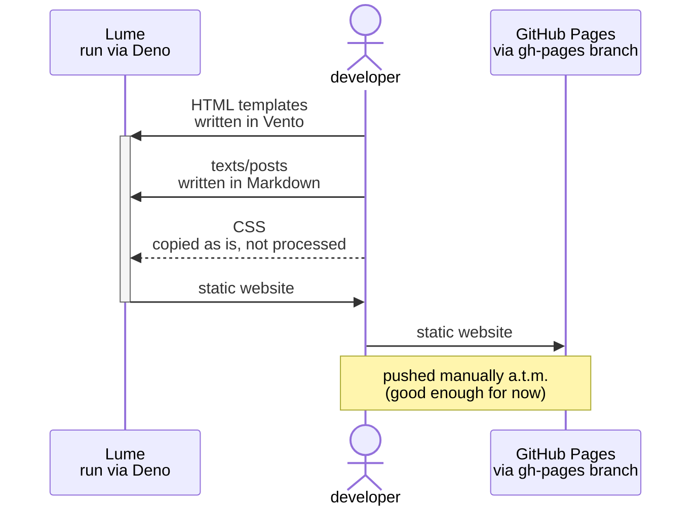

# Maxim Kamalov’s portfolio

## [implementation](./implementation.md)

```mermaid
sequenceDiagram
    participant Lume as Lume<br/>run via Deno
    actor me as developer
    participant gh as GitHub Pages<br/>via gh-pages branch
    me->>+Lume: HTML templates<br/>written in Vento
    me->>Lume: texts/posts<br/>written in Markdown
    me-->>Lume: CSS<br/>copied as is, not processed
    Lume->>-me: static website
    me->>gh: static website
    note over me,gh: pushed manually a.t.m.<br/>(good enough for now)
```
